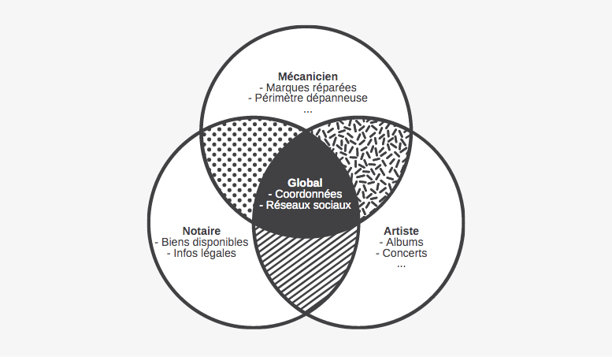

# Cursus : présentation
## Problématique
Dans le cadre de la création de sites vitrines, nous perdons souvent du temps en organisation et à nous demander quel contenu placer sur notre site.

Certaines informations sont récurrentes et peuvent être déclinées à tous les professionels ou presque : coordonnées, liens réseaux sociaux, horaires d'ouverture...

Certaines informations peuvent aussi être communes à tous les profesionnels d'un même milieu : tous les restaurateurs sont sensés avoir un menu, tous les notaires ont un catalogue de biens en vente, les artistes peuvent avoir un calendrier avec leurs concerts à venir...

Il est donc dommage de perdre du temps à chaque fois à lister toutes les caractéristiques de telle ou telle entreprise alors qu'elles sont communes à tous les acteurs de son milieu. Le but du projet **Cursus** est de faciliter l'organisation des sites vitrines en listant toutes les caractétistiques qui pourraient être attribués à un professionel.

---

## Principe de conception
Organisation sous forme de hierarchie inspirée de la programmation objet. Le niveau le plus haut `Global` représente les profesionnels dans leur ensemble. Ses branches représentent ensuite une spécialisation de plus en plus poussée à laquelle les informations applicables sont plus spécifique.

* Profesionnel (Global)
	* Artiste
		* Chanteur
		* Peintre
		* ...
	* Artisan
		* Boulanger
		* Plombier
		* ...

---

## Notes
Au départ uniquement pensé pour lister des caractéristiques pas forcément spécifiques au web, j'ai pensé que cela pouvait aussi être adapté à réunir d'autres informations : expressions habituelles de référencement, dossiers avec des photos libres de droit sélectionnées, templates de mentions légales...

Pour les évolutions du projet, je le rendrai éditable par des tiers.

Toutes les remarques et suggestions sont les bienvenues.

Le projet prendre en pertinence à force de temps et d'utilisation.